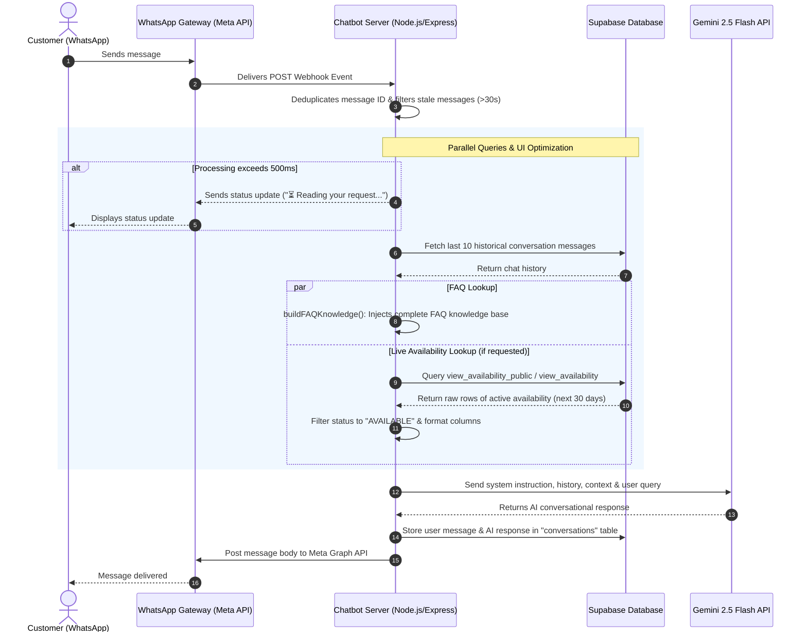

# Camp Mantap WhatsApp Chatbot — System Documentation

This document provides a comprehensive guide to the architecture, workflows, components, and integration touchpoints of the WhatsApp Chatbot for **Camp Mantap** (located near Bentong, Pahang).

The chatbot operates as a virtual assistant that handles customer inquiries via WhatsApp, answering general FAQs and providing live room/site booking availability in English or Malay. It leverages the **Gemini 2.5 Flash API** for conversational AI, **Supabase** for database logging and availability lookups, and the **Meta Graph API** for WhatsApp messaging.

---

## 1. System Architecture

The following diagram illustrates the complete end-to-end message flow and integration between the customer, WhatsApp Gateway, the Chatbot Server, Gemini, and Supabase.



---

## 2. Environment Configuration (`.env`)

The application is configured using environment variables. Below is the list of required variables:

| Variable Name | Description | Example / Format |
| :--- | :--- | :--- |
| `SUPABASE_URL` | The public URL endpoint of your Supabase project instance. | `https://xxxx.supabase.co` |
| `SUPABASE_SERVICE_KEY` | The secret service role API key bypasses RLS rules for saving conversation histories. | `eyJhbGciOi...` |
| `GEMINI_API_KEY` | Google Generative AI API Key for accessing Gemini 2.5 models. | `AIzaSy...` |
| `WHATSAPP_TOKEN` | System user access token generated in Meta Developer console for WhatsApp Cloud API. | `EAAG...` |
| `PHONE_NUMBER_ID` | The ID of the WhatsApp phone number registered in Meta App dashboard. | `304728...` |
| `VERIFY_TOKEN` | A secure arbitrary token of your choice configured in Meta Webhook Settings to verify the endpoint. | `my_secure_token` |
| `PORT` | Local port for the Express application server to run on (defaults to `3000`). | `3000` |

---

## 3. Core Modules & Functionality

The codebase consists of three main JavaScript modules:

### 3.1. `server.js` (The Application Orchestrator)
Acts as the central entry point and handles HTTP routing, request filtering, conversation state management, and final payload delivery.
* **Webhook Verification (`GET /webhook`)**: Checks if the signature matches `VERIFY_TOKEN` and returns the `hub.challenge` to establish connection with Meta.
* **Message Receipt Filtering**: Identifies and drops delivery/read status updates (`value.statuses`) to avoid redundant processing.
* **Deduplication**: Remembers processed message IDs in a memory `Set` (`processedMessageIds`) and ignores duplicates. Cleanup occurs automatically after 5 minutes to prevent memory leaks.
* **Latency Tolerant Feedback**: Installs a `setTimeout` that sends a loading message ("⏳ Reading your request...") if Gemini API call + DB lookup exceeds 500ms.
* **History Management**: Pulls the last 10 messages from the `conversations` table in Supabase. Ensures the history sent to Gemini begins with a `user` role turn (cleaning any leading `model` role outputs).
* **Welcome Engine**: Detects if a phone number has zero prior records. If true, delivers a predefined `WELCOME_MESSAGE` before generating the main response.
* **Retry Loop**: Incorporates a 3-attempt retry sequence with a 2-second sleep duration specifically when Gemini throws a `503 Service Unavailable` error.
* **Fallback Resolution**: If any uncaught error interrupts the execution, sends a fallback message directing the user to Miss Jenny directly: `+60 12-345 6789`.

### 3.2. `availability.js` (Live Availability Agent)
Dynamically reads live booking records from Supabase and translates database records into natural context.
* **Keyword Detection**: Checks the incoming query against standard English and Malay keywords (e.g., `booking`, `available`, `ada tapak`, `kosong`).
* **Auto-Discovery Schema Probing (`discoverSchema`)**:
  * Instead of hardcoding table names or column names, this function queries the first row of `view_availability_public`. If that fails, it falls back to `view_availability`.
  * Inspects the object keys of the retrieved record.
  * **Date Column Detection**:
    1. Looks for a value matching a `YYYY-MM-DD` date regex.
    2. Searches for common name patterns (`stay_date`, `date`, `tarikh`, `check_in`, `check_out`), skipping columns with `_of_` (such as `day_of_week`).
    3. Searches for any name containing `date`.
    4. Falls back to search for `start` or `begin`.
  * Caches the discovered view and column names globally within the node process to prevent redundant queries.
* **Availability Query (`checkAvailability`)**:
  * Requests availability records starting from today's date through the next 30 days.
  * Orders rows sequentially by date.
* **AI Prompt Serialization (`formatAvailabilityForAI`)**:
  * Resolves column definitions (Site/Room, Status, Price, Capacity, Notes).
  * Filters out occupied spots, only retaining rows matching status `AVAILABLE` or `OPEN`.
  * Outputs a structured text block: `• Date: YYYY-MM-DD | Site: Tapak A | Status: AVAILABLE | Price: RM X | Max pax: Y`.

### 3.3. `faq.js` (Knowledge Base)
Acts as the static source of truth for campsite parameters verified by administration.
* **Knowledge Entries**: Contains categorized FAQ items (Location & facilities, Check-in/out times, Mini Mart items, Cancellations & refunds, Electricity constraints, ATV Rides, Camper van policy, River safety).
* **Context Injection (`buildFAQKnowledge`)**:
  * Injects the entire FAQ database directly into the AI system instructions.
  * Relies on Gemini's large context window (1M+ tokens) to accurately match questions and synthesize responses without needing brittle keyword filters.

---

## 4. Logical Workflows

### 4.1. Incoming Message Lifecycle Workflow

The sequence of operations when a webhook is triggered follows:

```
[Incoming POST Request to /webhook]
                │
                ▼
      [Is this a message?] ─────── No ──────► [Send HTTP 200 (Ignore Receipts/Statuses)]
                │ Yes
                ▼
    [Is message type === text?] ─── No ──────► [Send HTTP 200 (Ignore Media/Others)]
                │ Yes
                ▼
    [Is message timestamp > 30s?] ─ Yes ─────► [Send HTTP 200 (Discard stale message)]
                │ No
                ▼
   [Duplicate message ID?] ─────── Yes ─────► [Send HTTP 200 (Avoid double response)]
                │ No
                ▼
   [Add ID to processedMessageIds]
   [Start 500ms Delay Timer]
                │
                ├───────────────────────────────────────┐
                ▼ (Sync execution)                      ▼ (Async timer)
     [Get Conversation History]                     [500ms Expired?]
                │                                       │
     [Is history empty (New Customer)?]                 ├── No ──► [Do nothing]
                │                                       │
                ├─────── Yes ──► [Send Welcome Message] │
                │                                       ▼ Yes
     [Fetch FAQ & Availability Context] ───────► [Send "Reading your request..." text]
                │
     [Construct System Prompt]
     [Invoke Gemini 2.5 Flash]
                │
         (Success / Retry)
                │
                ▼
     [Clear 500ms Delay Timer]
     [Save conversations to Supabase]
     [Post response text to Customer via Meta API]
```

### 4.2. Schema & Query Resolution in `availability.js`

To minimize maintenance as DB views evolve, the schema discovery executes as follows:

```
[Call getAvailabilityContext()]
               │
               ▼
     [Is message related to availability?] ─── No ──► [Return empty context]
               │ Yes
               ▼
   [Are viewName and dateCol cached?] ─────── Yes ─► [Query view with cached schema]
               │ No
               ▼
   [Fetch 1 row from view_availability_public] ─ Failed ─► [Fetch 1 row from view_availability]
               │ Success                                               │
               ├───────────────────────────────────────────────────────┤
               ▼
   [Scan columns for date: regex YYYY-MM-DD -> matches stay_date/date/tarikh]
   [Scan columns for site: room_type/site/tapak]
   [Cache discovery keys in memory]
               │
               ▼
   [Query rows where stay_date >= Today and stay_date <= Today + 30]
   [Filter rows where status === 'AVAILABLE' or 'OPEN']
   [Construct list of available spots and inject into Gemini prompt]
```

---

## 5. System Prompt, Fallback Rules & Safety Constraints

The AI assistant's default prompt is designed as a narrative description of Camp Mantap's services, policies, and the assistant's tasks to guide responses effectively:

### 5.1. System Prompt Narrative
The default prompt contains:
* **Campsite Overview**: A narrative introducing Camp Mantap as a premium riverfront campsite near Bentong, Pahang, emphasizing that every site directly faces the river.
* **Services & Facilities Guide**:
  * 24-hour electricity plug points (below 1000W, extension cable required).
  * Toilets with hot showers, dishwashing areas, firepits.
  * Self-service Mini Mart details (selling ice, firewood, snacks, drinks, operating via Touch 'n Go / QR).
  * WiFi (Celcom/Digi) and guided activities (ATV tours at RM 70/car, archery, seasonal fruits).
* **Strict Policies**:
  * Camper vans, RVs, and motorhomes are not recommended (due to narrow roads, clearance, single-phase power).
  * EV charging and portable power stations are strictly prohibited.
  * Official check-in (2:00 PM) / check-out (12:00 PM) times.
  * River flood safety standards (compound is 10 feet above riverbed, warning siren, active rain monitoring).
* **Assistant Tasks**:
  1. Greet guests and represent Camp Mantap in a professional, polite, matter-of-fact tone.
  2. Dynamic language support (Malay and English).
  3. Strict name personalization (remember and use customer's stated name).
  4. Context-based response compilation.
  5. Graceful hands-off to Miss Jenny for unhandled requests.

### 5.2. Safety Constraints
* **Context Adherence**: Gemini is instructed to answer strictly based on the system prompt narrative (about itself/services), and the dynamically injected FAQ and Availability contexts.
* **Identity & Service Inquiries**: If the customer asks who the assistant is or what general services Camp Mantap provides, the bot is allowed to answer using the prompt narrative and the corresponding entry in `faq.js`.
* **Missing Information Fallback**: If a query is not covered by the system prompt narrative, FAQ, or Availability Context, the bot is prohibited from guessing or using general knowledge. It is programmed to return the exact text containing Miss Jenny's direct contact details:
  ```text
  Sorry, I'm unable to provide an answer to that question at the moment. 😔
  
  For further details, please contact us directly:
  📞 +60 12-345 6789
  💬 https://wa.me/60123456789
  
  Miss Jenny will be happy to assist you.
  ```
* **Preferred Name Memory**: The prompt instructs Gemini to adopt and remember the name by which the customer wishes to be addressed.
* **Stale Message Defense**: Restricts webhook handling to messages under 30 seconds old to prevent spamming customers after server downtime.
* **WhatsApp-specific Formatting**: Constrains the AI to use lists starting with `- ` (never `* ` as bullets), wrap bold text with single asterisks (`*bold*`), avoid double asterisks (`**bold**`), and output well-spaced messages.
