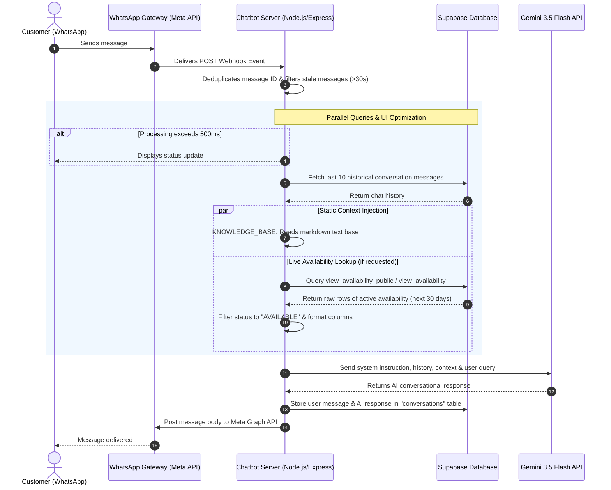

# Camp Mantap — Booking & Assistant System Documentation

Welcome to the official repository for **Camp Mantap** (located near Bentong, Pahang). This repository contains the complete ecosystem of tools designed to automate customer service, handle campsite FAQs via WhatsApp, and present booking availability.
---

## 1. System Architecture

The following diagram illustrates the complete end-to-end message flow and integration between the customer, WhatsApp Gateway, the Chatbot Server, Gemini, and Supabase.


```mermaid
sequenceDiagram
    autonumber
    actor Customer as Customer (WhatsApp)
    participant WA as WhatsApp Gateway (Meta API)
    participant Srv as Chatbot Server (Node.js/Express)
    participant DB as Supabase Database
    participant AI as Gemini 3.5 Flash API

    Customer->>WA: Sends message
    WA->>Srv: Delivers POST Webhook Event
    Srv->>Srv: Deduplicates message ID & filters stale messages (>30s)
    
    rect rgb(240, 248, 255)
        Note over Srv, DB: Parallel Queries & UI Optimization
        alt Processing exceeds 500ms
            Srv-->>Customer: Displays status update
        end
        
        Srv->>DB: Fetch last 10 historical conversation messages
        DB-->>Srv: Return chat history
        
        par Static Context Injection
            Srv->>Srv: KNOWLEDGE_BASE: Reads markdown text base
        and Live Availability Lookup (if requested)
            Srv->>DB: Query view_availability_public / view_availability
            DB-->>Srv: Return raw rows of active availability (next 30 days)
            Srv->>Srv: Filter status to "AVAILABLE" & format columns
        end
    end

    Srv->>AI: Send system instruction, history, context & user query
    AI-->>Srv: Returns AI conversational response
    Srv->>DB: Store user message & AI response in "conversations" table
    Srv->>WA: Post message body to Meta Graph API
    WA-->>Customer: Message delivered
```

---

## 2. Directory Structure

```text
├── camp_mantap_chatbot/          # Backend WhatsApp Webhook & AI server
│   ├── public/                   # Public static assets (privacy policy)
│   ├── availability.js           # Live availability querying & schema auto-discovery
│   ├── server.js                 # Express orchestration & Gemini integration
│   ├── knowledge_base.md         # Campsite rules, policies, and pricing (FAQ source)
│   ├── package.json              # Node dependencies
│   ├── README.md                 # Chatbot-specific developer pointers
│   └── .env                      # Local environment configuration file (ignored)

```

---

## 3. Environment Configuration (`.env`)

The chatbot application is configured using environment variables. Create a `.env` file inside the [camp_mantap_chatbot](file:///c:/Users/ricky/OneDrive/Desktop/kabel/Camp_mantap/camp_mantap_chatbot) directory with the following variables:

| Variable Name | Description | Example / Format |
| :--- | :--- | :--- |
| `SUPABASE_URL` | The public URL endpoint of your Supabase project instance. | `https://xxxx.supabase.co` |
| `SUPABASE_SERVICE_KEY` | The secret service role API key bypasses RLS rules for saving conversation histories. | `eyJhbGciOi...` |
| `GEMINI_API_KEY` | Google Generative AI API Key for accessing Gemini 3.5 models. | `AIzaSy...` |
| `WHATSAPP_TOKEN` | System user access token generated in Meta Developer console for WhatsApp Cloud API. | `EAAG...` |
| `PHONE_NUMBER_ID` | The ID of the WhatsApp phone number registered in Meta App dashboard. | `304728...` |
| `VERIFY_TOKEN` | A secure arbitrary token of your choice configured in Meta Webhook Settings to verify the endpoint. | `my_secure_token` |
| `PORT` | Local port for the Express application server to run on (defaults to `3000`). | `3000` |
| `ALERT_PHONE_NUMBER` | Optional phone number in WhatsApp international format to notify admins of webhook errors. | `60123456789` |

---

## 4. Core Modules & Functionality

### 4.1. [server.js](file:///c:/Users/ricky/OneDrive/Desktop/kabel/Camp_mantap/camp_mantap_chatbot/server.js) (Application Orchestrator)
Acts as the central entry point and handles HTTP routing, request filtering, conversation state management, and final payload delivery.
* **Webhook Verification (`GET /webhook`)**: Checks if the signature matches `VERIFY_TOKEN` and returns the `hub.challenge` to establish connection with Meta.
* **Message Receipt Filtering**: Identifies and drops delivery/read status updates (`value.statuses`) to avoid redundant processing.
* **Deduplication**: Remembers processed message IDs in a memory `Set` (`processedMessageIds`) and ignores duplicates. Cleanup occurs automatically after 5 minutes to prevent memory leaks.
* **History Management**: Pulls the last 10 messages from the `conversations` table in Supabase. Ensures the history sent to Gemini begins with a `user` role turn (cleaning any leading `model` role outputs).
* **Welcome Engine**: Detects if a phone number has zero prior records. If true, delivers a predefined `WELCOME_MESSAGE` before generating the main response.
* **Retry Loop**: Incorporates a 3-attempt retry sequence with a 2-second sleep duration specifically when Gemini throws a `503 Service Unavailable` error.
* **Fallback Resolution**: If any uncaught error interrupts the execution, sends a fallback message directing the user to Miss Jenny directly: `+60 12-345 6789`.

### 4.2. [availability.js](file:///c:/Users/ricky/OneDrive/Desktop/kabel/Camp_mantap/camp_mantap_chatbot/availability.js) (Live Availability Agent)
Dynamically reads live booking records from Supabase and translates database records into natural context.
* **Keyword Detection**: Checks the incoming query against standard English and Malay keywords (e.g., `booking`, `available`, `ada tapak`, `kosong`).
* **Auto-Discovery Schema Probing (`discoverSchema`)**:
  * Instead of hardcoding table names or column names, this function queries the first row of `view_availability_public`. If that fails, it falls back to `view_availability`.
  * Inspects the object keys of the retrieved record.
  * **Date Column Detection**:
    1. Looks for a value matching a `YYYY-MM-DD` date regex.
    2. Searches for common name patterns (`stay_date`, `date`, `tarikh`, `check_in`, `check_out`), skipping columns with `_of_` (such as `day_of_week`).
    3. Searches for any name containing `date`.
    4. Falls back to search for `start` or `begin`.
  * Caches the discovered view and column names globally within the node process to prevent redundant queries.
* **Availability Query (`checkAvailability`)**:
  * Requests availability records starting from today's date through the next 30 days.
  * Orders rows sequentially by date.
* **AI Prompt Serialization (`formatAvailabilityForAI`)**:
  * Resolves column definitions (Site/Room, Status, Price, Capacity, Notes).
  * Filters out occupied spots, only retaining rows matching status `AVAILABLE` or `OPEN`.
  * Outputs a structured text block: `• Date: YYYY-MM-DD | Site: Tapak A | Status: AVAILABLE | Price: RM X | Max pax: Y`.

### 4.3. [knowledge_base.md](file:///c:/Users/ricky/OneDrive/Desktop/kabel/Camp_mantap/camp_mantap_chatbot/knowledge_base.md) (Unified Knowledge Base)
Acts as the static source of truth for campsite parameters verified by administration.
* **Content Structure**: Contains all campsite rules, policies, schedules, locations, booking links, and facilities formatted in standard Markdown.
* **System Prompt Injection**: Loaded once during server start-up and injected directly into the Gemini `systemInstruction` context. This removes the need for brittle keyword-matching algorithms, giving the AI model native comprehension over all policies.

---

## 5. Logical Workflows

### 5.1. Incoming Message Lifecycle Workflow

The sequence of operations when a webhook is triggered:

```
[Incoming POST Request to /webhook]
                │
                ▼
      [Is this a message?] ─────── No ──────► [Send HTTP 200 (Ignore Receipts/Statuses)]
                │ Yes
                ▼
    [Is message type === text?] ─── No ──────► [Send HTTP 200 (Ignore Media/Others)]
                │ Yes
                ▼
    [Is message timestamp > 30s?] ─ Yes ─────► [Send HTTP 200 (Discard stale message)]
                │ No
                ▼
    [Duplicate message ID?] ─────── Yes ─────► [Send HTTP 200 (Avoid double response)]
                │ No
                ▼
    [Add ID to processedMessageIds]
    [Start 500ms Delay Timer]
                │
                ├───────────────────────────────────────┐
                ▼ (Sync execution)                      ▼ (Async timer)
      [Get Conversation History]                     [500ms Expired?]
                │                                       │
      [Is history empty (New Customer)?]                 ├── No ──► [Do nothing]
                │                                       │
                ├─────── Yes ──► [Send Welcome Message] │
                │                                       ▼ Yes
      [Load Knowledge Base & Fetch Availability] ──► [Send "Reading your request..." text]
                │
                [Construct System Prompt]
                [Invoke Gemini 3.5 Flash]
                │
         (Success / Retry)
                │
                ▼
      [Clear 500ms Delay Timer]
      [Save conversations to Supabase]
      [Post response text to Customer via Meta API]
```

### 5.2. Schema & Query Resolution in `availability.js`

To minimize maintenance as database views evolve, schema discovery executes as follows:

```
[Call getAvailabilityContext()]
               │
               ▼
      [Is message related to availability?] ─── No ──► [Return empty context]
               │ Yes
               ▼
    [Are viewName and dateCol cached?] ─────── Yes ─► [Query view with cached schema]
               │ No
               ▼
    [Fetch 1 row from view_availability_public] ─ Failed ─► [Fetch 1 row from view_availability]
               │ Success                                               │
               ├───────────────────────────────────────────────────────┤
               ▼
    [Scan columns for date: regex YYYY-MM-DD -> matches stay_date/date/tarikh]
    [Scan columns for site: room_type/site/tapak]
    [Cache discovery keys in memory]
               │
               ▼
    [Query rows where stay_date >= Today and stay_date <= Today + 30]
    [Filter rows where status === 'AVAILABLE' or 'OPEN']
    [Construct list of available spots and inject into Gemini prompt]
```

---

## 6. System Prompt, Fallback Rules & Safety Constraints

### 6.1. System Prompt Narrative
The default prompt contains:
* **Campsite Overview**: A narrative introducing Camp Mantap as a premium riverfront campsite near Bentong, Pahang, emphasizing that every site directly faces the river.
* **Services & Facilities Guide**:
  * 24-hour electricity plug points (below 1000W, extension cable required).
  * Toilets with hot showers, dishwashing areas, firepits.
  * Self-service Mini Mart details (selling ice, firewood, snacks, drinks, operating via Touch 'n Go / QR).
  * WiFi (Celcom/Digi) and guided activities (ATV tours at RM 70/car, archery, seasonal fruits).
* **Strict Policies**:
  * Camper vans, RVs, and motorhomes are not recommended (due to narrow roads, clearance, single-phase power).
  * EV charging and portable power stations are strictly prohibited.
  * Official check-in (2:00 PM) / check-out (12:00 PM) times.
  * River flood safety standards (compound is 10 feet above riverbed, warning siren, active rain monitoring).
* **Assistant Tasks**:
  1. Greet guests and represent Camp Mantap in a professional, polite, matter-of-fact tone.
  2. Dynamic language support (Malay and English).
  3. Strict name personalization (remember and use customer's stated name).
  4. Context-based response compilation.
  5. Graceful hands-off to Miss Jenny for unhandled requests.

### 6.2. Safety Constraints
* **Context Adherence**: Gemini is instructed to answer strictly based on the system prompt narrative (about yourself/services), and the injected Knowledge Base and Availability contexts.
* **Identity & Service Inquiries**: If the customer asks who the assistant is or what general services Camp Mantap provides, the bot is allowed to answer using the system prompt narrative or the [knowledge_base.md](file:///c:/Users/ricky/OneDrive/Desktop/kabel/Camp_mantap/camp_mantap_chatbot/knowledge_base.md) details.
* **Missing Information Fallback**: If a query is not covered by the system prompt narrative, Knowledge Base, or Availability Context, the bot is prohibited from guessing or using general knowledge. It is programmed to return the exact text containing Miss Jenny's direct contact details:
  ```text
  Sorry, I'm unable to provide an answer to that question at the moment. 😔
  
  For further details, please contact us directly:
  📞 +60 12-345 6789
  💬 https://wa.me/60123456789
  
  Miss Jenny will be happy to assist you.
  ```
* **Preferred Name Memory**: The prompt instructs Gemini to adopt and remember the name by which the customer wishes to be addressed.
* **Stale Message Defense**: Restricts webhook handling to messages under 30 seconds old to prevent spamming customers after server downtime.
* **WhatsApp-specific Formatting**: Constrains the AI to use lists starting with `- ` (never `* ` as bullets), wrap bold text with single asterisks (`*bold*`), avoid double asterisks (`**bold**`), and output well-spaced messages.

---
## 7. Local Setup & Running

Follow these steps to run the chatbot server locally:

1. **Install Dependencies**:
   ```bash
   cd camp_mantap_chatbot
   npm install
   ```

2. **Configure Environment Variables**:
   Create a `.env` file in the [camp_mantap_chatbot](file:///c:/Users/ricky/OneDrive/Desktop/kabel/Camp_mantap/camp_mantap_chatbot) directory and configure your keys as shown in **Section 3**.

3. **Start the Express Server**:
   ```bash
   npm start
   ```
   The server runs on the port configured in your `.env` file (defaults to `3000`).

4. **Run Availability Plugin Dashboard**:
   Simply open [index.html](file:///c:/Users/ricky/OneDrive/Desktop/kabel/Camp_mantap/Availability_plugin/index.html) in any web browser. Use the gear configuration modal to save your Supabase credentials locally inside your browser's localStorage.

---

## 8. Webhook Tunneling via Ngrok

Since Meta's WhatsApp Cloud API requires an HTTPS callback URL to deliver message webhooks, establish a local secure tunnel:

1. **Start Ngrok**:
   ```bash
   ngrok http 3000
   ```

2. **Copy the HTTPS URL**:
   Copy the secure address generated by Ngrok (e.g., `https://xxxx.ngrok-free.app`).

3. **Configure the Meta Developer Portal**:
   - Go to your Meta App Dashboard -> **WhatsApp** -> **Configuration**.
   - Under **Webhook**, click **Edit**.
   - **Callback URL**: Enter `https://xxxx.ngrok-free.app/webhook`.
   - **Verify Token**: Enter the exact same value as your `VERIFY_TOKEN` in your `.env` file.
   - Click **Verify and save**.
   - Under **Webhook fields**, click **Manage** and subscribe to **messages**.
