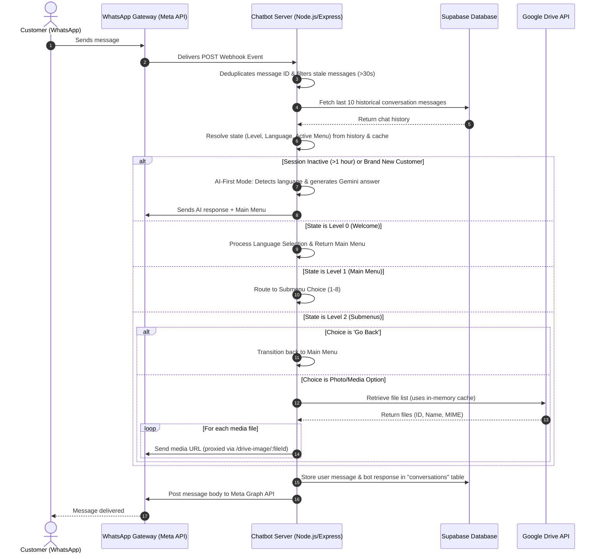

# Camp Mantap — Booking & Assistant System Documentation

Welcome to the official repository for **Camp Mantap** (located near Bentong, Pahang). This repository contains the complete ecosystem of tools designed to automate customer service, handle campsite FAQs via WhatsApp, present booking availability, and manage WhatsApp Embedded Signup onboarding.

---

## 1. System Architecture

The following diagram illustrates the complete end-to-end message flow and integration between the customer, WhatsApp Cloud API, the Chatbot Server (Node.js), Supabase, and Google Drive.


```mermaid
sequenceDiagram
    autonumber
    actor Customer as Customer (WhatsApp)
    participant WA as WhatsApp Gateway (Meta API)
    participant Srv as Chatbot Server (Node.js/Express)
    participant DB as Supabase Database
    participant Drive as Google Drive API

    Customer->>WA: Sends message
    WA->>Srv: Delivers POST Webhook Event
    Srv->>Srv: Deduplicates message ID & filters stale messages (>30s)
    
    Srv->>DB: Fetch last 10 historical conversation messages
    DB-->>Srv: Return chat history
    
    Srv->>Srv: Resolve state (Level, Language, Active Menu) from history & cache
    
    alt Session Inactive (>1 hour) or Brand New Customer
        Srv->>Srv: AI-First Mode: Detects language & generates Gemini answer
        Srv->>WA: Sends AI response + Main Menu
    else State is Level 0 (Welcome)
        Srv->>Srv: Process Language Selection & Return Main Menu
    else State is Level 1 (Main Menu)
        Srv->>Srv: Route to Submenu Choice (1-8)
    else State is Level 2 (Submenus)
        alt Choice is 'Go Back'
            Srv->>Srv: Transition back to Main Menu
        else Choice is Photo/Media Option
            Srv->>Drive: Retrieve file list (uses in-memory cache)
            Drive-->>Srv: Return files (ID, Name, MIME)
            loop For each media file
                Srv->>WA: Send media URL (proxied via /drive-image/:fileId)
            end
        end
    end

    Srv->>DB: Store user message & bot response in "conversations" table
    Srv->>WA: Post message body to Meta Graph API
    WA-->>Customer: Message delivered
```

---

## 2. Directory Structure

```text
├── camp_mantap_chatbot/          # Backend WhatsApp Webhook & AI server
│   ├── public/                   # Public static assets served by the Express server
│   │   ├── coexistence.html      # WhatsApp Embedded Signup (Coexistence Onboarding) page
│   │   ├── privacy-policy.html   # Privacy policy page
│   ├── availability.js           # DEPRECATED: Deprecated availability querying module
│   ├── google-drive.js           # Google Drive API connection, service authentication & caching
│   ├── server.js                 # Express app setup, routing, state-machine, and Gemini integration
│   ├── knowledge_base.md         # Campsite rules, policies, and pricing (FAQs reference markdown)
│   ├── package.json              # Project dependencies & startup scripts
│   ├── README.md                 # System developer and operations guide
│   └── .env                      # Local environment configuration file (gitignored)
```

---

## 3. Environment Configuration (`.env`)

The chatbot application is configured using environment variables. Create a `.env` file inside the `camp_mantap_chatbot` directory with the following variables:

### 3.1. General & Database Config
| Variable Name | Description | Example / Format |
| :--- | :--- | :--- |
| `PORT` | Local port for the Express application server to run on (defaults to `3000`). | `3000` |
| `SERVER_URL` | The public endpoint of your deployed server (needed to build media proxy URLs). | `https://xxxx.railway.app` |
| `ALERT_PHONE_NUMBER` | Phone number in international format to notify admins of chatbot webhook errors. | `60123456789` |
| `SUPABASE_URL` | The public URL endpoint of your Supabase project instance. | `https://xxxx.supabase.co` |
| `SUPABASE_SERVICE_KEY` | Secret service role API key to bypass RLS rules when fetching/saving chat history. | `eyJhbGciOi...` |
| `SUPABASE_SCHEMA` | Database schema name used in Supabase. | `public` or `campmantap` |

### 3.2. WhatsApp & AI Config
| Variable Name | Description | Example / Format |
| :--- | :--- | :--- |
| `WHATSAPP_TOKEN` | WhatsApp Cloud API System User Access Token generated in the Meta Developer Console. | `EAAeR...` |
| `PHONE_NUMBER_ID` | Phone number ID registered inside the Meta App WhatsApp dashboard. | `1092203400652358` |
| `VERIFY_TOKEN` | Secure arbitrary verification token matching the Webhook configuration in Meta Developer portal. | `neo123` |
| `GEMINI_API_KEY` | Google Generative AI API Key for accessing the Gemini models. | `AIzaSy...` |
| `GEMINI_MODEL` | Gemini model version to use (defaults to `gemini-3.5-flash`). | `gemini-1.5-flash` |

### 3.3. Google Drive Configuration
| Variable Name | Description | Example / Format |
| :--- | :--- | :--- |
| `GDRIVE_CREDENTIALS_PATH` | Local file path to the Google Service Account JSON key file. | `./google-credentials.json` |
| `GDRIVE_CREDENTIALS_JSON` | Production environment JSON string containing the full Google Service Account credentials. | `{"type": "service_account", ...}` |
| `GDRIVE_CAMPSITE` | Google Drive folder ID for campsite photos (Tapak 1–9). | `1a2b3c...` |
| `GDRIVE_CAMPTYPE` | Google Drive folder ID for camp type style folders (Style A/B/C). | `1a2b3c...` |
| `GDRIVE_ACTIVITY` | Google Drive folder ID for activity photos (ATV, archery, durian). | `1a2b3c...` |
| `GDRIVE_PRICE` | Google Drive folder ID for pricing posters. | `1a2b3c...` |
| `GDRIVE_TENT_PRICE` | Google Drive folder ID for tent rental package posters. | `1a2b3c...` |
| `GDRIVE_VIDEO` | Google Drive folder ID for camp videos. | `1a2b3c...` |
| `GDRIVE_MISC` | Google Drive folder ID for campsite pricelist, maps, and layouts. | `1a2b3c...` |
| `GDRIVE_SCENERY` | Google Drive folder ID for camp scenery photos (morning, night, river). | `1a2b3c...` |

---

## 4. Core Modules & Functionality

### 4.1. `server.js` (Application Orchestrator)
Acts as the central router and coordinator for incoming WhatsApp webhooks, state resolution, and automated responses.
* **Webhook Verification (`GET /webhook`)**: Validates challenge token from Meta Cloud API using the configured `VERIFY_TOKEN`.
* **State Resolution**: Reads the last 10 historical database logs from Supabase. Resolves conversation level (`0` = Welcome, `1` = Main Menu, `2` = Sub-menus) by looking backwards for known templates.
* **AI-First / Re-entry Mode**: If a customer is brand new (no history) or has been silent for more than 1 hour (`SESSION_TTL_MS = 3600000`), the bot triggers **AI-First Mode**. The message is processed by Gemini, which answers naturally, detects the language, caches it, and appends the Main FAQ Menu to guide the customer.
* **Language Persistency**: Maintains language choice (`bm` or `en`) using an in-memory process cache (`langCache`) as the primary source, falling back to database history.
* **Interactive Media Requests**: Categorizes and matches incoming keywords or submenu clicks to trigger automated image uploads from Google Drive (e.g. atv, campsite, scenery, refund records).
* **Human Handoff**: Intercepts requests to chat with a human or Miss Jenny and sends `HUMAN_HANDOFF_MESSAGE`.

### 4.2. `google-drive.js` (Google Drive Integration)
Connects to Google Drive using a Google Service Account to list, sort, and retrieve media assets dynamically.
* **Service Account Auth**: Resolves credentials dynamically via path file `GDRIVE_CREDENTIALS_PATH` or direct JSON string configuration `GDRIVE_CREDENTIALS_JSON` for cloud services (like Railway).
* **Caching Layer**: Caches images, subfolders, and video file meta-lists for 60 seconds (`CACHE_TTL_MS`) to bypass Google Drive API rate-limits and avoid synchronous overhead.
* **Categorized Searches**: Uses regular expressions to match requested categories against subfolder names or file names inside Google Drive.

### 4.3. `public/coexistence.html` (WhatsApp Embedded Onboarding)
Provides a front-end interface that triggers the Facebook SDK Login with embedded signup configurations (`config_id`, `featureType: 'whatsapp_business_app_onboarding'`). This allows Camp Mantap to securely onboard their official WhatsApp Business API account within the system.

---

## 5. Diagnostic & Proxy Routes

The server exposes several diagnostic endpoints to ease debugging and verify integrations:

* **`GET /health`**
  Returns `OK` (HTTP 200) to verify the Express server is online.
  
* **`GET /test-db`**
  Executes diagnostic checks against Supabase. Runs a `SELECT` query, performs a temporary `INSERT` into the `conversations` table, and immediately cleans it up using a `DELETE` command.
  
* **`GET /test-drive`**
  Checks credentials and listings for all Google Drive folder IDs configured in the environment. Returns file counts, image/video counts, and subfolder lists for each active folder.

* **`GET /drive-image/:fileId`**
  A secure streaming proxy that fetches binaries from Google Drive using the Service Account and pipes them to WhatsApp/clients.
  * Sets the correct `Content-Type` and metadata.
  * Supports **HTTP Range requests** (`Range` header) with byte offsets, which is required by WhatsApp's media servers to buffer and stream videos correctly.

---

## 6. Logical Workflows

### 6.1. Webhook Message Lifecycle

```
[Incoming POST Request to /webhook]
                │
                ▼
      [Is this a message?] ─────── No ──────► [Send HTTP 200 (Ignore Receipts/Statuses)]
                │ Yes
                ▼
    [Is message type === text?] ─── No ──────► [Send HTTP 200 (Ignore Media/Others)]
                │ Yes
                ▼
    [Is message timestamp > 30s?] ─ Yes ─────► [Send HTTP 200 (Discard stale message)]
                │ No
                ▼
    [Duplicate message ID?] ─────── Yes ─────► [Send HTTP 200 (Avoid double response)]
                │ No
                ▼
    [Add ID to processedMessageIds]
                │
                ▼
      [Get Conversation History]
                │
                ▼
    [Is human handoff requested?] ── Yes ───► [Send HUMAN_HANDOFF_MESSAGE] ──► (End)
                │ No
                ▼
    [Resolve Active State (level, lang, menu) from last assistant message]
                │
                ├───────────────────────┬────────────────────────┐
                ▼                       ▼                        ▼
       [Level 0 (Welcome)]     [Level 1 (Main Menu)]    [Level 2 (Submenus)]
                │                       │                        │
       [Check lang selection]   [Check choice (1-8)]     [Check choice (A-F/0)]
       - BM: Main Menu BM       - 1: Gen Info Menu       - standard FAQ text:
       - EN: Main Menu EN       - ...                      Send answer + repeat submenu
       - Else: Welcome Msg      - 8: Availability links  - Photo choice:
                                                           Send photos + repeat submenu
                                                         - Go Back:
                                                           Send Main Menu
                │                       │                        │
                └───────────────────────┼────────────────────────┘
                                        │
                                        ▼
                         [Save conversation to Supabase]
                         [Send Response Text to Customer]
                         [Send HTTP 200] (End)
```

---

## 7. Local Setup & Execution

1. **Install Dependencies**:
   ```bash
   cd camp_mantap_chatbot
   npm install
   ```

2. **Configure Credentials**:
   * Create a `.env` file as detailed in **Section 3**.
   * Place your Google Service Account key JSON in the project root as `google-credentials.json` (or set `GDRIVE_CREDENTIALS_JSON` / `GDRIVE_CREDENTIALS_PATH`).

3. **Start the Server**:
   ```bash
   npm start
   ```

4. **Ngrok Webhook Tunneling** (For local development):
   Ensure Meta can route requests to your machine:
   ```bash
   ngrok http 3000
   ```
   Configure the resulting HTTPS URL (`https://xxxx.ngrok-free.app/webhook`) as your Webhook callback inside the Meta Developer Portal.
