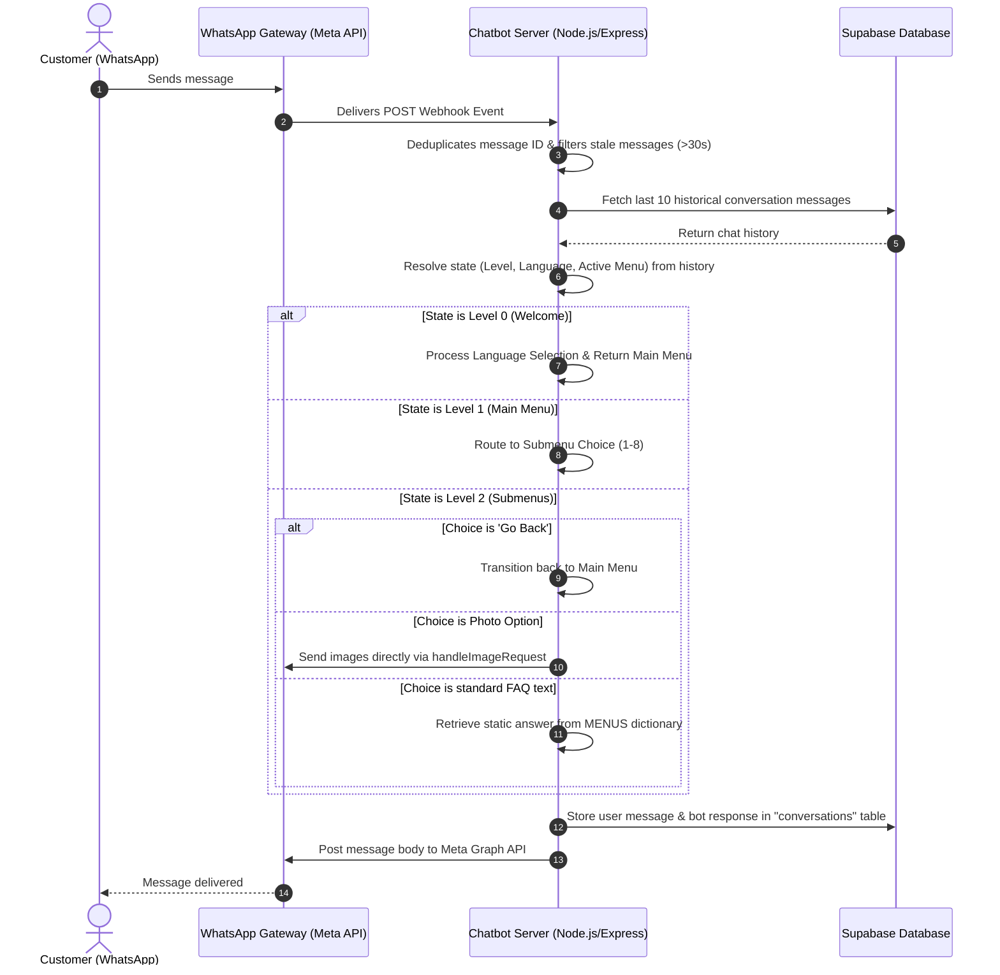

# Camp Mantap — Booking & Assistant System Documentation

Welcome to the official repository for **Camp Mantap** (located near Bentong, Pahang). This repository contains the complete ecosystem of tools designed to automate customer service, handle campsite FAQs via WhatsApp, and present booking availability.
---

## 1. System Architecture

The following diagram illustrates the complete end-to-end message flow and integration between the customer, WhatsApp Gateway, the Chatbot Server, and Supabase using a multi-level state-machine.


```mermaid
sequenceDiagram
    autonumber
    actor Customer as Customer (WhatsApp)
    participant WA as WhatsApp Gateway (Meta API)
    participant Srv as Chatbot Server (Node.js/Express)
    participant DB as Supabase Database

    Customer->>WA: Sends message
    WA->>Srv: Delivers POST Webhook Event
    Srv->>Srv: Deduplicates message ID & filters stale messages (>30s)
    
    Srv->>DB: Fetch last 10 historical conversation messages
    DB-->>Srv: Return chat history
    
    Srv->>Srv: Resolve state (Level, Language, Active Menu) from history
    
    alt State is Level 0 (Welcome)
        Srv->>Srv: Process Language Selection & Return Main Menu
    else State is Level 1 (Main Menu)
        Srv->>Srv: Route to Submenu Choice (1-8)
    else State is Level 2 (Submenus)
        alt Choice is 'Go Back'
            Srv->>Srv: Transition back to Main Menu
        else Choice is Photo Option
            Srv->>WA: Send images directly via handleImageRequest
        else Choice is standard FAQ text
            Srv->>Srv: Retrieve static answer from MENUS dictionary
        end
    end

    Srv->>DB: Store user message & bot response in "conversations" table
    Srv->>WA: Post message body to Meta Graph API
    WA-->>Customer: Message delivered
```

---

## 2. Directory Structure

```text
├── camp_mantap_chatbot/          # Backend WhatsApp Webhook & AI server
│   ├── public/                   # Public static assets (privacy policy, images)
│   │   ├── images/               # Campsite and tent rental image files
│   │   └── privacy-policy.html   # Privacy policy page
│   ├── availability.js           # Live availability querying & schema auto-discovery
│   ├── server.js                 # Express orchestration & Gemini integration
│   ├── knowledge_base.md         # Campsite rules, policies, and pricing (FAQ source)
│   ├── package.json              # Node dependencies
│   ├── README.md                 # Chatbot-specific developer pointers
│   └── .env                      # Local environment configuration file (ignored)
```

---

## 3. Environment Configuration (`.env`)

The chatbot application is configured using environment variables. Create a `.env` file inside the [camp_mantap_chatbot](file:///c:/Users/ricky/OneDrive/Desktop/kabel/Camp_mantap/camp_mantap_chatbot) directory with the following variables:

| Variable Name | Description | Example / Format |
| :--- | :--- | :--- |
| `SUPABASE_URL` | The public URL endpoint of your Supabase project instance. | `https://xxxx.supabase.co` |
| `SUPABASE_SERVICE_KEY` | The secret service role API key bypasses RLS rules for saving conversation histories. | `eyJhbGciOi...` |
| `GEMINI_API_KEY` | Google Generative AI API Key for accessing Gemini 3.5 models. | `AIzaSy...` |
| `WHATSAPP_TOKEN` | System user access token generated in Meta Developer console for WhatsApp Cloud API. | `EAAG...` |
| `PHONE_NUMBER_ID` | The ID of the WhatsApp phone number registered in Meta App dashboard. | `304728...` |
| `VERIFY_TOKEN` | A secure arbitrary token of your choice configured in Meta Webhook Settings to verify the endpoint. | `my_secure_token` |
| `PORT` | Local port for the Express application server to run on (defaults to `3000`). | `3000` |
| `ALERT_PHONE_NUMBER` | Optional phone number in WhatsApp international format to notify admins of webhook errors. | `60123456789` |

---

## 4. Core Modules & Functionality

### 4.1. [server.js](file:///c:/Users/ricky/OneDrive/Desktop/kabel/Camp_mantap/camp_mantap_chatbot/server.js) (Application Orchestrator)
Acts as the central entry point and handles HTTP routing, request filtering, conversation state management, and final payload delivery using a structured state machine.
* **Webhook Verification (`GET /webhook`)**: Checks if the signature matches `VERIFY_TOKEN` and returns the `hub.challenge` to establish connection with Meta.
* **Message Receipt Filtering**: Identifies and drops delivery/read status updates (`value.statuses`) to avoid redundant processing.
* **Deduplication**: Remembers processed message IDs in a memory `Set` (`processedMessageIds`) and ignores duplicates. Cleanup occurs automatically after 5 minutes to prevent memory leaks.
* **History Management & State Resolution**: Pulls the last 10 messages from the `conversations` table in Supabase. Resolves the active state (`level`, `lang`, `menu`) dynamically by searching backwards for known menu prompt templates.
* **Menu Routing Engine**:
  * **Level 0**: Language Selection prompt (English or Bahasa Melayu).
  * **Level 1**: Main Menu containing 8 topics.
  * **Level 2**: Topic-specific sub-menus (prompts and answers) derived from `knowledge_base.md`.
* **Direct Image Integration**: Automatically calls `handleImageRequest` to stream campsite photos, camp layouts, scenery, and activities photos when corresponding sub-menu options are selected, seamlessly resuming menu prompts afterwards.
* **Human Handoff**: Intercepts phrases requesting real human support or Miss Jenny and directs them to manual admin contact.
* **Fallback Resolution**: If any uncaught error interrupts the execution, sends a fallback message asking the customer to try again later.

### 4.2. [knowledge_base.md](file:///c:/Users/ricky/OneDrive/Desktop/kabel/Camp_mantap/camp_mantap_chatbot/knowledge_base.md) (Unified Knowledge Base)
Acts as the static source of truth for campsite parameters verified by administration. All menus, submenus, prices, policies, and details are aligned with this file.

---

## 5. Logical Workflows

### 5.1. Incoming Message Lifecycle Workflow

The sequence of operations when a webhook is triggered:

```
[Incoming POST Request to /webhook]
                │
                ▼
      [Is this a message?] ─────── No ──────► [Send HTTP 200 (Ignore Receipts/Statuses)]
                │ Yes
                ▼
    [Is message type === text?] ─── No ──────► [Send HTTP 200 (Ignore Media/Others)]
                │ Yes
                ▼
    [Is message timestamp > 30s?] ─ Yes ─────► [Send HTTP 200 (Discard stale message)]
                │ No
                ▼
    [Duplicate message ID?] ─────── Yes ─────► [Send HTTP 200 (Avoid double response)]
                │ No
                ▼
    [Add ID to processedMessageIds]
                │
                ▼
     [Get Conversation History]
                │
                ▼
    [Is human handoff requested?] ── Yes ───► [Send HUMAN_HANDOFF_MESSAGE] ──► (End)
                │ No
                ▼
    [Resolve Active State (level, lang, menu) from last assistant message]
                │
                ├───────────────────────┬────────────────────────┐
                ▼                       ▼                        ▼
       [Level 0 (Welcome)]     [Level 1 (Main Menu)]    [Level 2 (Submenus)]
                │                       │                        │
       [Check lang selection]   [Check choice (1-8)]     [Check choice (A-F/0)]
       - BM: Main Menu BM       - 1: Gen Info Menu       - standard FAQ text:
       - EN: Main Menu EN       - 2: Campsites Menu        Send answer + repeat submenu
       - Else: Welcome Msg      - ...                    - Photo choice:
                                - 8: Availability links    Send photos + repeat submenu
                                                         - Go Back (0 / letter):
                                                           Send Main Menu
                │                       │                        │
                └───────────────────────┼────────────────────────┘
                                        │
                                        ▼
                         [Save conversation to Supabase]
                         [Send Response Text to Customer]
                         [Send HTTP 200] (End)
```

---

## 6. Menu Logic & Formatting Constraints

### 6.1. State-Machine Rules
* **Language Persistency**: The bot maintains the customer's language choice (`bm` or `en`) automatically once selected at Level 0, using it to display all subsequent Level 1 and Level 2 menus.
* **Deterministic Responses**: No generative LLM is used, guaranteeing that information matches the official `knowledge_base.md` parameters exactly and never hallucinates.
* **Looping Menus**: At Level 2, displaying an answer automatically appends the submenu prompt below it, allowing the customer to continue typing options without getting lost.
* **Universal Go Back**: Customers can type `0`, `00`, `back`, `kembali`, `menu`, or the menu-specific Go Back letters at any time to return to the Main Menu.

### 6.2. WhatsApp-specific Formatting
* **Lists & Bullets**: All option lists and bullet points use `- ` (dash followed by a space) to ensure clean rendering on mobile devices.
* **Bold Formatting**: Wrapped in single asterisks `*like this*`. Double asterisks `**` are strictly avoided since they are not supported by the WhatsApp client.
* **Stale Message Defense**: Restricts webhook handling to messages under 30 seconds old to prevent spamming customers after server downtime.

---

## 7. Local Setup & Running

Follow these steps to run the chatbot server locally:

1. **Install Dependencies**:
   ```bash
   cd camp_mantap_chatbot
   npm install
   ```

2. **Configure Environment Variables**:
   Create a `.env` file in the [camp_mantap_chatbot](file:///c:/Users/ricky/OneDrive/Desktop/kabel/Camp_mantap/camp_mantap_chatbot) directory and configure your keys as shown in **Section 3**.

3. **Start the Express Server**:
   ```bash
   npm start
   ```
   The server runs on the port configured in your `.env` file (defaults to `3000`).

4. **Run Availability Plugin Dashboard**:
   Simply open [index.html](file:///c:/Users/ricky/OneDrive/Desktop/kabel/Camp_mantap/Availability_plugin/index.html) in any web browser. Use the gear configuration modal to save your Supabase credentials locally inside your browser's localStorage.

---

## 8. Webhook Tunneling via Ngrok

Since Meta's WhatsApp Cloud API requires an HTTPS callback URL to deliver message webhooks, establish a local secure tunnel:

1. **Start Ngrok**:
   ```bash
   ngrok http 3000
   ```

2. **Copy the HTTPS URL**:
   Copy the secure address generated by Ngrok (e.g., `https://xxxx.ngrok-free.app`).

3. **Configure the Meta Developer Portal**:
   - Go to your Meta App Dashboard -> **WhatsApp** -> **Configuration**.
   - Under **Webhook**, click **Edit**.
   - **Callback URL**: Enter `https://xxxx.ngrok-free.app/webhook`.
   - **Verify Token**: Enter the exact same value as your `VERIFY_TOKEN` in your `.env` file.
   - Click **Verify and save**.
   - Under **Webhook fields**, click **Manage** and subscribe to **messages**.
